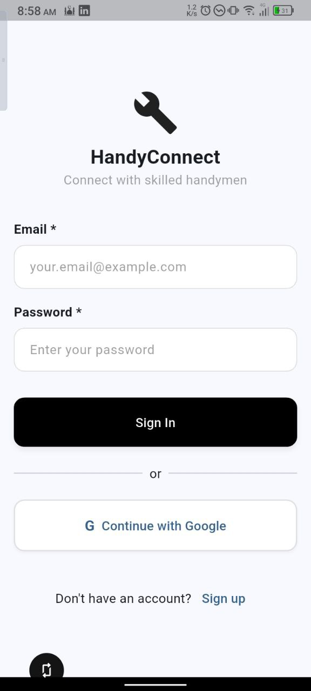
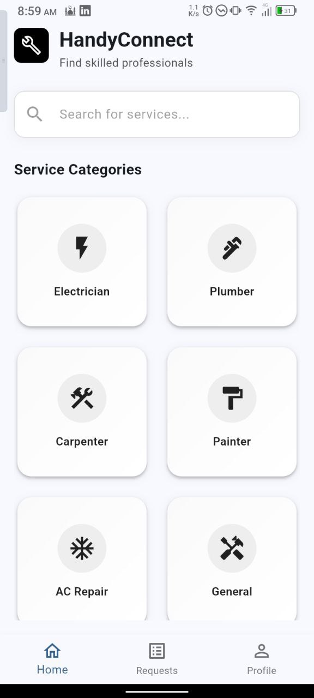
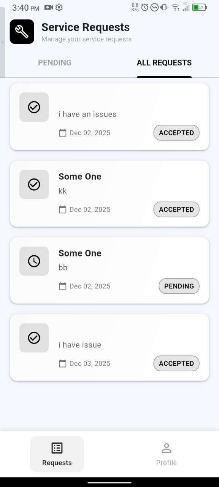
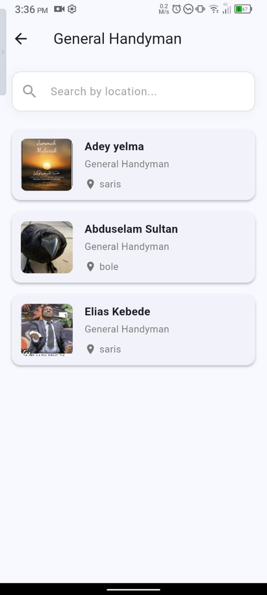
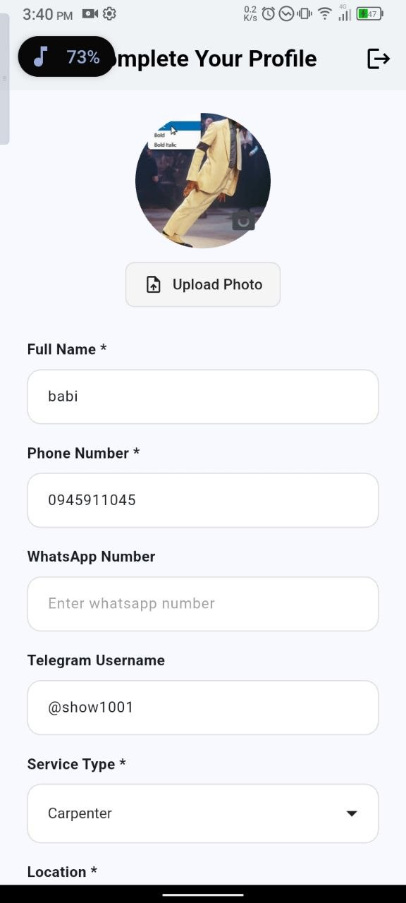

# Handy Connect

A Flutter application that connects customers with skilled handymen for various services.

## Features

- **User Authentication**: Secure login and registration for both customers and handymen.
- **Customer Features**:
  - Browse available handymen.
  - Book services.
  - Manage appointments.
- **Handyman Features**:
  - Create and manage a professional profile.
  - View and respond to job requests.
  <p align="center">
  
  
   
   
    

   
</p>

## Technologies Used

- **Framework**: Flutter
- **State Management**: flutter_bloc
- **Backend**: Firebase (Authentication, Cloud Firestore)
- **Routing**: go_router
- **Dependency Injection**: get_it
- **Image Handling**: image_picker, cloudinary
- **Other Key Packages**: dartz, equatable, intl

## Getting Started

### Prerequisites

- Flutter SDK
- A configured IDE (like VS Code or Android Studio)

### Installation

1. Clone the repository:
   ```sh
   git clone https://github.com/your-username/handy_connect.git
   ```
2. Navigate to the project directory:
   ```sh
   cd handy_connect
   ```
3. Install dependencies:
   ```sh
   flutter pub get
   ```

### Running the Application

```sh
flutter run
```

## Project Structure

The project follows a feature-driven architecture:

- `lib/core`: Contains shared code, utilities, and core functionalities.
- `lib/features`: Contains the individual features of the application, such as `auth`, `customer`, and `handyman`.
- `lib/main.dart`: The entry point of the application.
